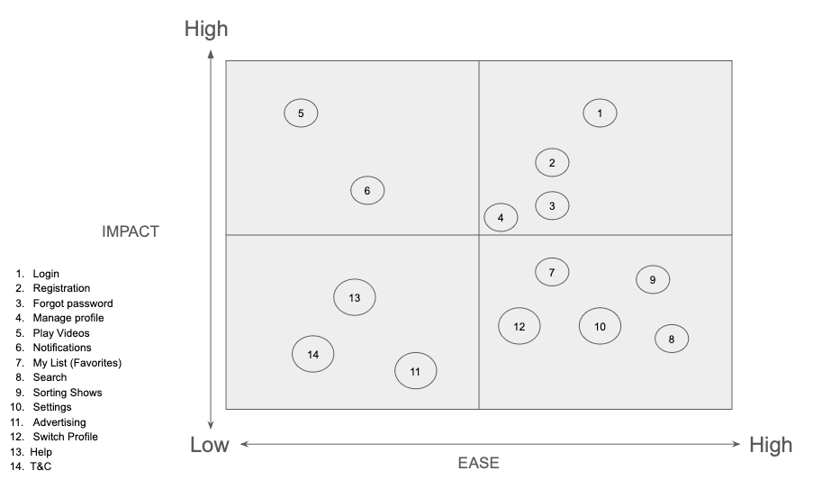
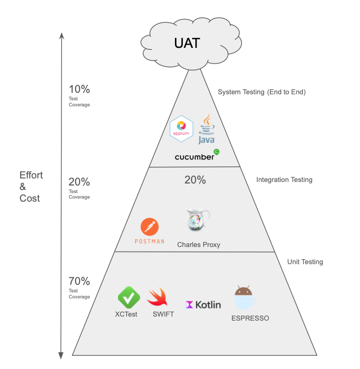
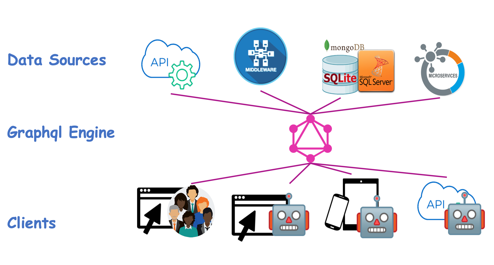
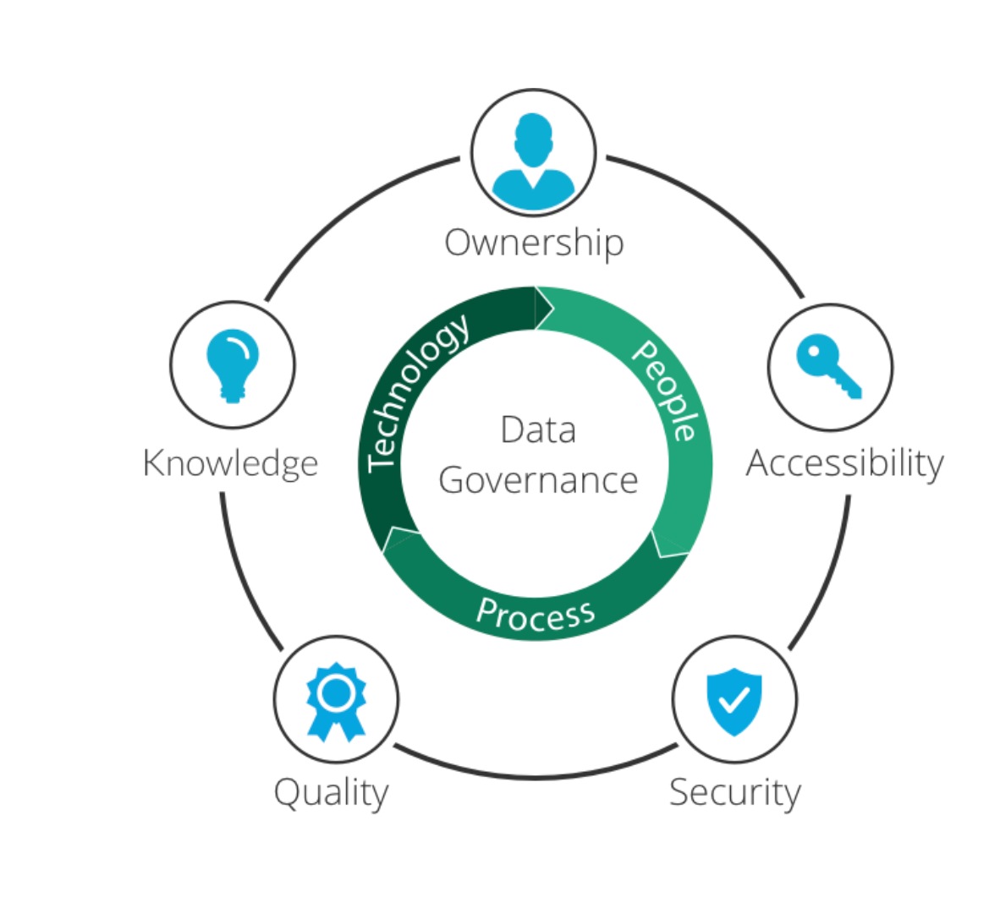
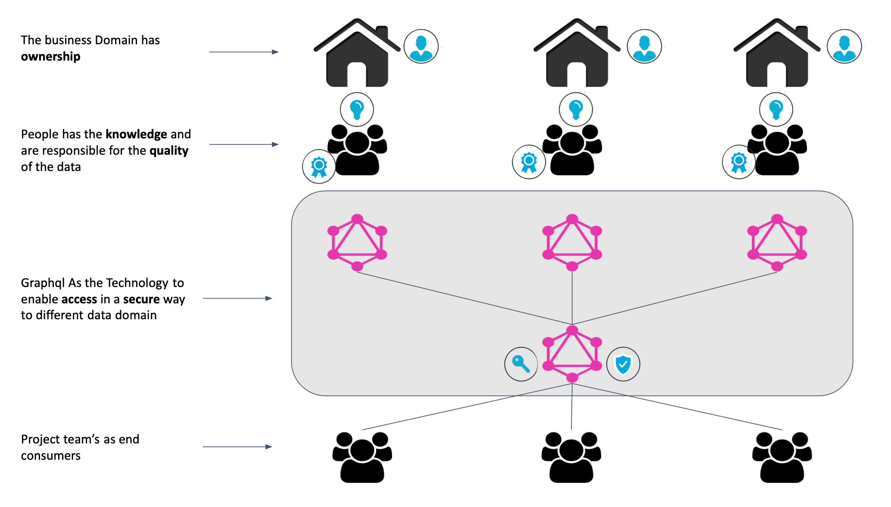
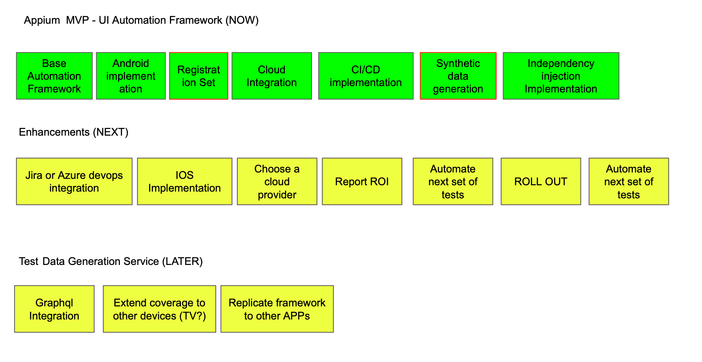

# TVNZ Challenge

TVNZ+ Minimum Viable Product (MVP) for a mobile automation framework. The goal is to automate critical aspects of a mobile application, and you have the freedom to choose which feature to test as well as the tooling and framework.


## Task 1: Framework Design

### Feature Selection
Given the freedom to choose which feature to test, discuss your thought process for selecting a specific feature for the MVP. Explain the criteria you consider, and justify why you choose a particular feature over others.

####  Step 1: List Customer's experience or features

I would run this exercise as a collective effort with the team, brainstorming list of existing features or user experiences in the mobile application.

The output of this step is a flat list of features example:

- Login
- Registration
- Forgot password
- Manage profile
- Play Videos
    - Live TV
    - Movies
    - News
    - Categories
        - Kids
    - ETC
- Notifications
- My List (Favourites)
- Search
- Sorting Shows
- Settings
- Advertising
- Switch Profile

#### Step 2: Prioritise features

For this step i would use an `AISE` Matrix, to identify the following combination:
- high impact high ease (P1 - High Impact customer's features  and High ease Testing effort)
- high impact low ease (P2 - High Impact customer's features and Low Testing effort)
- Low impact high ease (P3 - Low customer impact features and High ease Testing effort)
- Low impact low ease (P4 - Low customer impact features and Low Testing effort)

The output of this step is a prioritised matrix:


Note:
Impact = features that bring the most value to customers
Ease = Testing effort (this is both manual and automation)

### Step 3: Test Execution & Reporting

In order to test TVNZ+ mobile application I would follow the ACC (Attribute, component, capability) testing approach, this approach was design by google and its primary objective is to test capabilities over features, I personally find this approach very useful since it helps the team to have common understanding about the product or component

> Note:   
> A capability is the intersection between an attribute and a component, for example we can be testing the Secure attribute of the login component, we can then say the 'Login component is Secure When un-authorized user Do NOT have access to Buggy Car ratings'

for the testing of TVNZ+ I would used the following attributes:

- **Secure**: Focus in finding any type of vulnerability in the application
- **Compliance**: Focus in testing any expected results or acceptance criteria
- **Auditable**: Focus in testing any transaction traceability
- **Accessible**: Focus in testing the application from the perspective of a person with different abilities
- **Responsive**: Focus in testing the application in different screen sizes and screen dimensions
- **Compatibility** : Focus of this testing would be in testing the application across different platforms

an example of this output would be the following google sheet:

**[Download ACC Matrix test artifact](https://github.com/rafcasto/WestPacConsolidateInterview/raw/master/assests/WestPac_ACC_Matrix.xlsx)**

[](https://github.com/rafcasto/WestPacConsolidateInterview/blob/master/assests/ACC_DASHBOARD.JPG)

> Note:   
> This document contains three tabs
>
> - **Summary**: 360 view of the overall testing progress, summary of the test execution including number of open/close defects, number of failed capabilities and total number of capabilities or scenarios
> - **Scenarios**: Details of each capability/scenario that has been tested, I also have added few comments on the capabilities that have failed
> - **Defects**: this tabs contains a bug report, document is ready to perform a defect triage and keep record of the team conversation around each defect, collaboration is key :)
### Tooling Choice
Delve into the factors influencing your choice of tools for the mobile automation framework. Consider the flexibility of tools and their suitability for the chosen feature. Justify your tooling choices for testing, reporting, version control, and any other relevant aspects.

### Technology stack represented thru the test pyramid



#### System Testing (Mobile Automation)

**Java**: TVNZ is a java shop, the use of java as primary language, the use of this programming language will facilitate the adoption of the new framework and reduce the stress on the team from learning a new programming language.

**Appium**: This is an OpenSource solution which means it is cost effective, Appium has been in the market for more than a decade and its community is active and growing  providing great support for any adopters, Appium servers as a proxy between the two platforms Android and iOS minimising the cognitive overload of learning two separate tools, in the negative side due to the complexity of interacting with two separate platforms Appium consumes high amount of   resources when executing test locally, if application has not being designed with testability in mind, any test might result in unreliable results.

**Cucumber:** Cucumber is a framework that allows to write automated test scenarios using english syntax, it is great for anyone who is starting their journey in automation, and enables the team to have a share language and logic, Cucumber also offer a layer of abstraction making it ease to implement new scenarios for people who has little to no knowledge in programming

**Reporting**: to keep control of the different test artefacts I would integrate the automation test framework with the test management of choice this could be Jira or Azure DevOps, every-time the automation test suite is executed it will be report directly to the test manager tool, another reporting metric to consider is the ROI of test automation.

**Version Control**: in-house versioning control, i would also review the branching strategy depending on the maturity of the team i would suggest git flow or mono branch, git flow if the team is less experience in DevOps and mono branching strategy if the team is mature, the CI/CD pipeline is as good as the branching strategy.

## Task 2: Automation Test Development
### Test Data Management

Share your approach to managing test data for the chosen feature. How would you handle various test scenarios, and what considerations would guide your decisions?

#### Tactical Approach
The following is a tactical approach to data management, for this exercise i have use  data faker library, this allows me to generate a unique set of synthetic  data every time the test is executed

Example:
```java
package tvnz.interview.challange.ui.dto;  
  
import io.netty.util.internal.StringUtil;  
  
public class AccountDetails extends BaseDto  
{  
    public String getEmail()  
    {  
        return email;  
    }  
  
    public void setEmail(String email) {  
  
        if(StringUtil.isNullOrEmpty(email))  
        {  
            this.email = getFaker().internet().emailAddress();  
            return;  
        }  
        this.email = returnDefaultString(email);  
    }  
  
    public String getPassword() {  
        return password;  
    }  
  
    public void setPassword(String password) {  
        if(StringUtil.isNullOrEmpty(password))  
        {  
            this.password = getFaker().internet().password();  
            return;  
        }  
        this.password = returnDefaultString(password);  
    }  
  
    private String email;  
    private String password;  
  
    public void updateAccountDetails(){  
        this.setEmail(this.email);  
        this.setPassword(this.password);  
    }  
}
```

> [!Observe]
> Data rules are encapsulated as part of the setters methods example:
>  ```java
  >     public void setEmail(String email) {  
>	  if(StringUtil.isNullOrEmpty(email))  
>        {  
>            this.email = getFaker().internet().emailAddress();  
>            return;  
>        }  
>        this.email = returnDefaultString(email);  
>    }  
 >  ```

#### Stratigic Approach

For a more robust and future proof solution i would suggest Graphql as test data management.

##### high level  Architecture




#### Governance




#### High level implantation & Governance



### Automation Development
Using your selected mobile automation tool, provide a simplified script to automate the chosen feature. Highlight the essential steps and demonstrate your tool&#39;s effectiveness in addressing challenges related to the selected feature.

https://github.com/rafcasto/TVNZ-interview-challenge

I will show this step during the Demo :)

## Task 3: Continuous Integration/Continuous Deployment (CI/CD)

### CI/CD Integration
Suppose you are working in an environment that follows CI/CD
practices. How would you integrate your mobile automation framework into the CI/CD
pipeline?

http://jenkins.terepay.com:8080

User & password on request

## Bonus Question: MVP Iterations and Enhancements

### Iteration Plan
Outline your plan for iterative development of the MVP. How would you prioritize additional features or improvements? Consider feedback from testing cycles and stakeholder input.

### Future Feature Expansion
Explore potential features you would consider incorporating into the framework in the future. Discuss how the MVP sets the foundation for expanding test coverage to other critical app features.

High level plan ( NOW / NEXT / LATER )




Note: the framework is ready for implementation 